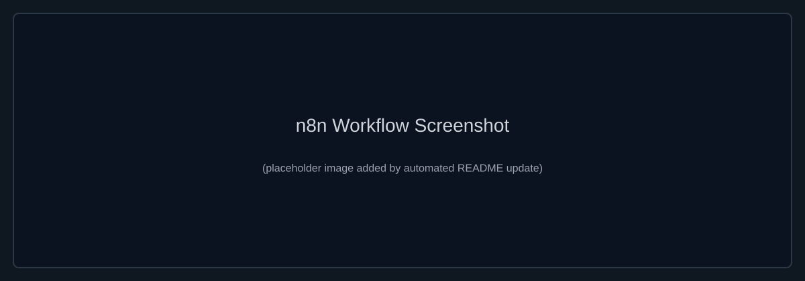

# Student Analyser AI

An intelligent student risk assessment and analytics platform that combines AI-powered analysis with an interactive web interface. Upload your class roster and get comprehensive risk reports, predi[...]

## 🎯 Features

### Core Analysis
- **AI-Powered Risk Prediction**: Uses OpenAI GPT models to analyze student data and predict academic risk
- **Automated Data Validation**: Cleans and validates student records from CSV/Excel files
- **Comprehensive Metrics**: Calculates risk scores, attendance patterns, GPA trends, and engagement levels
- **Early Intervention Alerts**: Identifies at-risk students with dropout probability predictions

### Interactive Dashboard
- **Drag-and-Drop File Upload**: Simple interface for uploading CSV or Excel student rosters
- **Real-Time Analysis**: Immediate processing and risk assessment
- **Visual Report Cards**: Color-coded metrics displayed as interactive cards
- **PDF Report Generation**: Converts analysis results into formatted PDF reports
- **Embedded Report Preview**: View detailed HTML reports inline

### AI Chat Assistant
- **Student Data Q&A**: Ask questions about your class data and get instant answers
- **Natural Language Queries**: "Which students are at risk?" or "What's the average GPA?"
- **Context-Aware Responses**: Assistant has access to all analyzed student data
- **Session Persistence**: Maintains conversation history within a session

## 📋 How It Works

### The Pipeline

1. **Upload** - Submit a CSV or Excel file with student data (name, ID, GPA, attendance, etc.)
2. **Extract** - Automated extraction and parsing of student information
3. **Validate** - Data cleaning and validation to ensure quality
4. **Analyze** - AI model processes each student's profile and predicts risk levels
5. **Calculate** - Dashboard KPIs and class-wide statistics are computed
6. **Generate** - Professional HTML and PDF reports with visualizations
7. **Store** - Results saved to n8n data table for later reference
8. **Chat** - Interact with the assistant to explore results



#### Live Demo
- Try the deployed workflow here: https://aman1980.app.n8n.cloud/form/15905efa-ae87-4e8d-9dbc-e1a7d1757dd2

### What Gets Analyzed

For each student, the system evaluates:
- **Risk Level**: Low, Medium, or High
- **Risk Score**: Numerical risk indicator (0-100)
- **Dropout Probability**: Predicted likelihood of dropping out
- **Pass Probability**: Expected success rate
- **Predicted Grade**: AI-estimated final grade
- **Trends**: Improving/declining performance patterns
- **Anomalies**: Unusual behaviors or data inconsistencies
- **Recommendations**: Specific intervention suggestions

## 🚀 Getting Started

### Prerequisites
- Access to an n8n instance (free or self-hosted)
- OpenAI API credentials (for AI analysis)
- PDFShift API key (for PDF generation)
- A modern web browser

### Setup

#### 1. Import the n8n Workflow
- Import the `student-analyser-ai.json.json` workflow into your n8n instance
- This sets up all the processing pipeline, data tables, and webhooks

#### 2. Configure API Credentials
- Add your OpenAI API key to n8n
- Add your PDFShift API key (for PDF conversion)
- These are used by the workflow nodes for AI analysis and PDF generation

#### 3. Set Up Webhooks
- Get your n8n webhook URLs from the workflow
- Configure them in the Student Analyser UI:
  - **Upload webhook**: Handles file uploads and triggers analysis
  - **Chat webhook**: Powers the AI assistant Q&A

#### 4. Deploy the HTML Interface
- Host `student_analyser (1).html` on any web server or open locally
- Enter your webhook URLs in the settings panels
- Start analyzing students!

## 💡 Usage

### Basic Analysis Flow

1. Click on the dropzone or browse to select a CSV/Excel file
2. File must include columns for: name, student ID, GPA, attendance, etc.
3. Click **"Grade my class →"** button
4. Wait for AI analysis to complete
5. Review the risk report cards
6. Download the PDF report if needed

### Using the Chat Assistant

1. Click the blue **💬** chat button (bottom right)
2. Configure your chat webhook URL in settings
3. Ask questions like:
   - "How many students are at-risk?"
   - "Which students have the lowest attendance?"
   - "What's the average GPA?"
4. Get instant answers powered by your actual data

### Understanding the Report

- **Risk Cards**: Quick visual overview of key metrics
- **Report HTML**: Detailed analysis with charts and tables
- **PDF Export**: Formatted report ready for stakeholders
- **Raw JSON**: Full data export for custom analysis

## 📊 Data Storage

Results are stored in n8n data tables, which includes:
- Student names and IDs
- Calculated risk levels and scores
- Predictions and probabilities
- Engagement scores
- Assignment tracking
- AI-generated recommendations

Access this data directly from n8n or query it via the chat assistant.

## 🎨 UI Features

- **Chalkboard Theme**: Dark board-like interface with chalk-colored text and colorful accents
- **Responsive Design**: Works on desktop and mobile devices
- **Interactive Cards**: Tilted sticky-note style cards for metrics
- **Loading Animations**: Visual feedback during analysis
- **Error Handling**: Clear error messages and validation

## ⚙️ Configuration

### Session Settings
- **Webhook URL**: Your n8n upload form webhook endpoint
- **Binary Field Name**: The field name in your webhook (default: "data")
- **Chat Webhook URL**: Your n8n chat webhook endpoint

All settings are stored in-session (not persisted to browser storage for privacy).

## 🔧 Technical Stack

- **Frontend**: HTML5, vanilla JavaScript, responsive CSS
- **Backend/Workflow**: n8n automation platform
- **AI/LLM**: OpenAI GPT models (gpt-4o-mini)
- **PDF Generation**: PDFShift API
- **Data Storage**: n8n data tables
- **APIs**: REST webhooks for communication

## 📝 File Format Requirements

### Supported Formats
- **.csv** - Comma-separated values
- **.xlsx** - Excel spreadsheets
- **.xls** - Legacy Excel files

### Required Columns (example)
```
name, studentId, gpa, attendance, engagementScore, assignmentsMissed
John Smith, S001, 3.2, 92, 8, 1
Jane Doe, S002, 2.1, 75, 5, 3
```

Column names are flexible - the system adapts to common variations.

## 🔐 Security & Privacy

- Webhook URLs stored in-session only (cleared on page refresh)
- No data sent to external services except OpenAI and PDFShift (as configured)
- Files processed server-side by your n8n instance
- No browser storage used for sensitive configuration

## 📞 Support & Troubleshooting

### Issue: "Could not reach the assistant"
- Verify your webhook URLs are correct
- Check n8n workflow is active and published
- Ensure n8n instance is accessible

### Issue: Analysis not starting
- Confirm file format is CSV or Excel
- Check file includes required student data columns
- Review webhook URL configuration in settings

### Issue: PDF not generating
- Verify PDFShift API key is configured in n8n
- Check API credits/quota in PDFShift dashboard
- Try exporting as HTML instead

## 🎓 Educational Use Cases

- Identify struggling students early in the term
- Monitor attendance and engagement trends
- Predict which students may need tutoring support
- Generate quarterly risk assessments
- Track intervention effectiveness
- Create data-driven coaching strategies
- Support retention initiatives

## 📈 Roadmap Ideas

- Bulk historical analysis
- Custom risk thresholds
- Export to LMS/SIS systems
- Parent/student notifications
- Comparative analytics (cohort benchmarking)
- Multi-class analysis
- Intervention tracking and feedback loops

## 🤝 Contributing

This is an open project. Feel free to:
- Report issues and bugs
- Suggest improvements
- Contribute enhancements
- Share use cases and feedback

## 📄 License

Open source - modify and deploy for your institution.

---

**Built with ❤️ for educators and student success**

Drop your class roster. Get actionable insights. Help students succeed. 🎯
